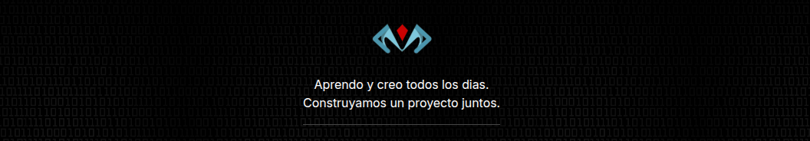

   

<h1 align="center">
  Hola, soy VMz
  
</h1>

 
<!--  -->

<!--  -->

  

👨‍💻 &nbsp;Soy **desarrollador web en formación** y estudiante universitario, enfocado en crear proyectos web funcionales, claros y bien estructurados.\
💡 &nbsp;Me gusta explorar nuevas tecnologías y aplicarlas en proyectos reales y académicos.\
🎓 &nbsp;Actualmente estudio una carrera universitaria relacionada con tecnología y he participado en varios proyectos académicos completos y funcionales.\
🌱 &nbsp;En este momento estoy reforzando JavaScript y aprendiendo más a fondo Angular y React, sin descuidar mis bases en backend y bases de datos.\
✍️ &nbsp;En mi tiempo libre desarrollo proyectos personales, mejoro mi portafolio y experimento con nuevas herramientas.\
💬 &nbsp;Puedes escribirme si te interesa colaborar, proponer un proyecto o simplemente hablar de tecnología.\
✉️ &nbsp;Puedes contactarme por correo o LinkedIn: viemvema@gmail.com | https://www.linkedin.com/in/vmz69/ .\
📄 &nbsp;Te invito a ver mi portafolio web y mis proyectos aquí: https://vmz-dev.netlify.app/ 

 

## 🧠 Tecnologías

### 🔹 Dominio / Uso frecuente

	
   

### 🔹 En aprendizaje activo

	

### 🔹 Experiencia académica y proyectos

### 🔹 Otros conocimientos y herramientas

&nbsp;

	
   
   
   
   	
---
## 📂 Proyectos

En mis repositorios encontrarás:

- Aplicaciones web funcionales  
- Sistemas académicos completos  
- Prácticas de frontend y lógica  
- Proyectos colaborativos universitarios  

👉 Revisa los repositorios fijados para ver mis proyectos principales.

---

## 🎯 Objetivo

Seguir desarrollando proyectos web cada vez más sólidos, profundizar en frameworks modernos y fortalecer mis bases backend para evolucionar hacia un perfil full-stack.

---

  

## 📫 Contacto

